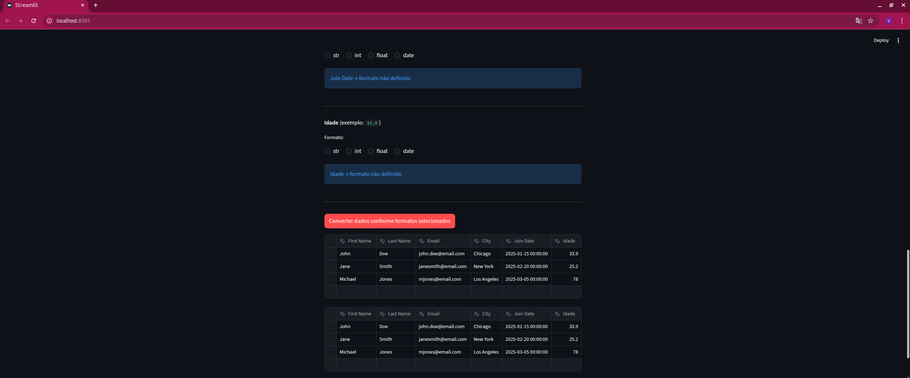
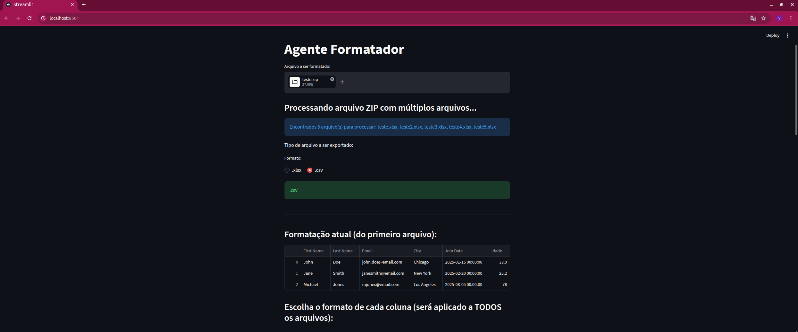
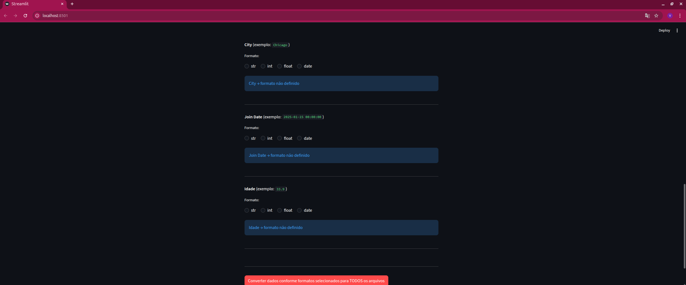
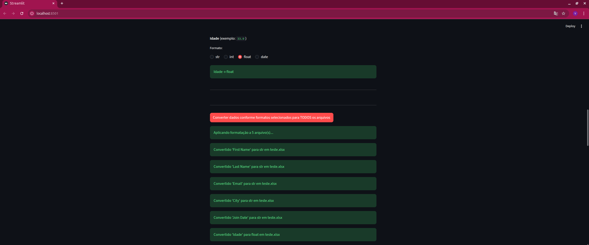
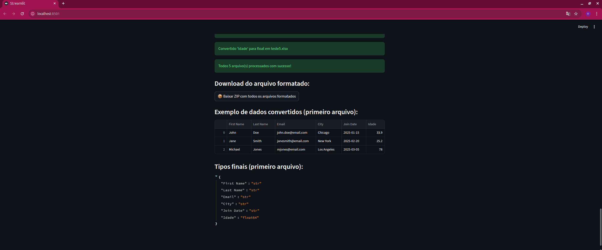
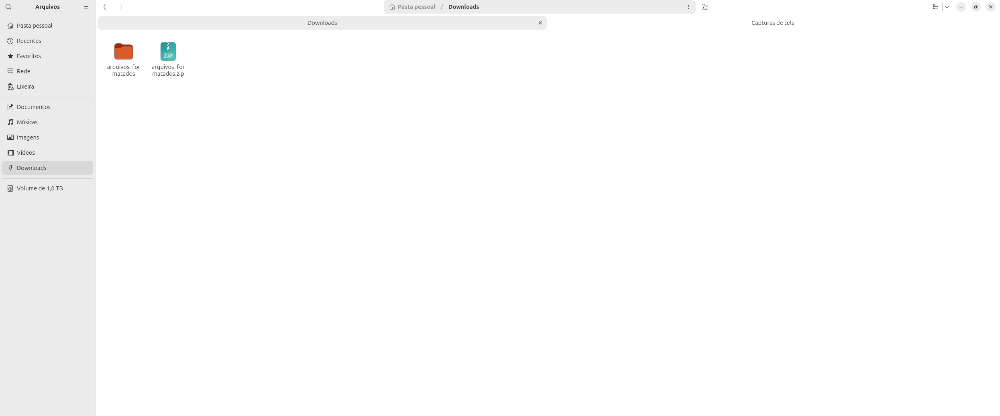
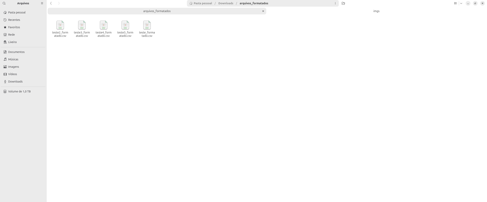
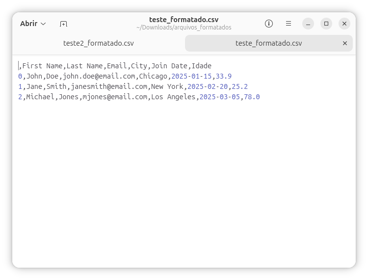

# Agente Formatador
## Esta solução interativa permite auxiliar o processo de formatação/validação dos dados

## Como rodar
### 1. Clone este repositório
__1.0 Com o terminal aberto, execute para clonar o repositório:__
    
    git clone https://github.com/DadosComCafe/agente_formatador.git

__1.1 Navegue até a raíz do projeto:__

    cd agente_formatador

### 2.Configure o ambiente
__2.0 Para este projeto, usaremos o gerenciador de dependências python uv. Portanto, na raiz do projeto execute:__

    uv sync

Com isso, um diretório chamado .venv será criado na raiz do projeto. Este diretório contem o ambiente python isolado.

### 3. Rode o servidor que irá levantar o agente:

    uv run convert_types.py

## Utilizando o agente

__1. Acessando a página home:__

 
__2.1 Enviando uma planilha:__ 

_________________________________________________________________

__2.2 Enviando um zip de planilhas:__

_________________________________________________________________

_________________________________________________________________

__3.0 Formatando as planilhas:__

_________________________________________________________________

__4.0 Acessando arquivos formatados:__

_________________________________________________________________

__4.1 Abrindo os arquivos formatados:__

## Ainda em construção!
